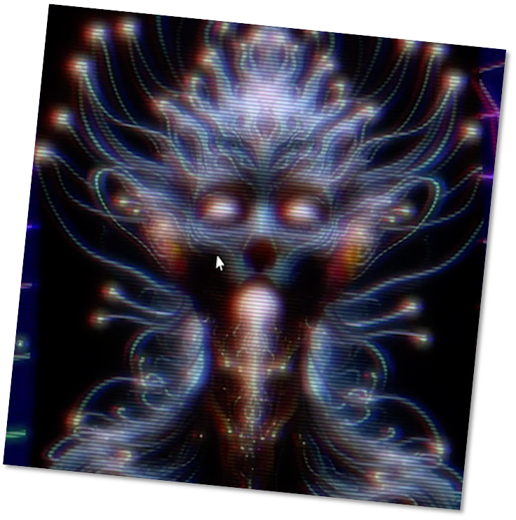

# The Ai Music Generation Challenge 2023 Submission: Varexian Music

Collaboration at Texas A&M University (USA) and Cascade Technologies (USA)

Team members: Matthew Campbell, Joseph Virskus, Will Connor, Jeffrey M. Morris

> Varexians are beings of energy and sound from the planet Varexia, who explore other planets and make music by communing with living musical beings called Sonic Fae. A few Varexian musicologists emerged in our work, leaning heavily on the teachings of Elyra Vunaris – who obliged us with an interview.

> Our inquiry produced details on several Sonic Fae, as well as Varexian compositions, culture, politics, writing system, and philosophy. We also collected several quotes by Elyra Vunaris, anecdotes, and an account of a countercultural movement called Dissonant Echoes: a rebellious and unconventional facet of Varexian music culture serving as a reminder that even in a culture deeply rooted in harmony and unity, there are always voices that yearn to explore and express the uncharted and the unconventional.

[Varexian Music Directory](VarexianMusic)